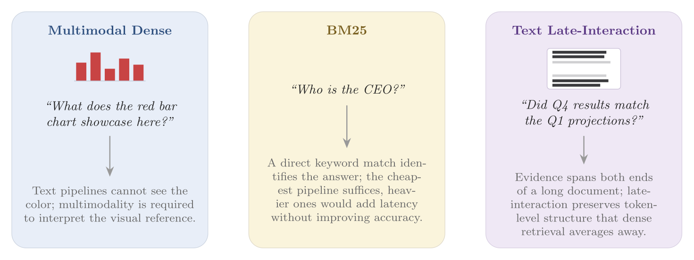
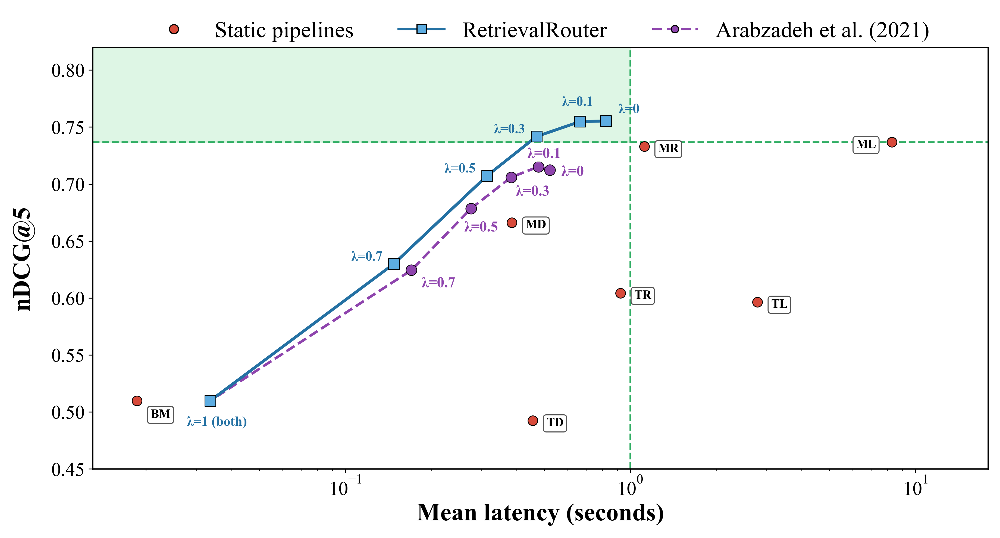

# RetrievalRouter: Joint Modality and Architecture Selection for Document Retrieval

<p align="center">
  <a href="https://2026.emnlp.org"></a>
  <a href="https://arxiv.org/pdf/2608.23176"></a>
  <a href="https://huggingface.co/collections/emrekuruu/retrieval-router"></a>
  <a href="LICENSE"></a>
</p>

<p align="center">
  <strong>Emre Kuru · Mehmet Onur Keskin · Reza Farahbakhsh · Noel Crespi</strong>
</p>

This repository is the official implementation of [**RetrievalRouter: Joint Modality and Architecture Selection for Document Retrieval**](https://arxiv.org/pdf/2608.23176).

<p align="center">
  <a href="#quick-start">Quick Start</a> ·
  <a href="#models-data-and-predictions">Artifacts</a> ·
  <a href="#training">Training</a> ·
  <a href="#evaluation">Evaluation</a> ·
  <a href="#citation">Citation</a>
</p>

## Motivation

Document retrieval pipelines make different trade-offs across modality, architecture, effectiveness, and cost. Figure 1 shows why a fixed pipeline is inadequate: visual references require multimodal retrieval, direct factoids may need only BM25, and long-context comparisons benefit from fine-grained interaction.

<p align="center">
  
</p>

<p align="center"><em>Different queries require different retrieval capabilities.</em></p>

## Results

Across benchmarks spanning financial and scientific corpora, **no static pipeline dominates**. RetrievalRouter learns, from the query text alone, which retrieval pipeline best fits each query. **For every static baseline, RetrievalRouter offers an operating point that is simultaneously more accurate and faster.**

<p align="center">
  
</p>

<p align="center"><em>Static pipelines, RetrievalRouter operating points, and the adapted Arabzadeh et al. (2021) baseline. Adaptive latency includes 15 ms of policy inference once per query.</em></p>

## Models, Data, and Predictions

The [Hugging Face collection](https://huggingface.co/collections/emrekuruu/retrieval-router) provides every released dataset and all trained RetrievalRouter and baseline checkpoints.

| Benchmark | Dataset | Queries | Documents | Avg. tokens |
|---|---|---:|---:|---:|
| REAL-MM-RAG | FinReport | 853 | 2,687 | 1,053 |
| REAL-MM-RAG | FinSlides | 1,048 | 2,280 | 275 |
| T2-RAGBench | FinQA | 6,232 | 2,789 | 965 |
| T2-RAGBench | ConvFinQA | 3,431 | 1,806 | 966 |
| T2-RAGBench | VQAonBD | 9,772 | 1,787 | 780 |
| T2-RAGBench | TAT-DQA | 27,127 | 2,758 | 852 |
| MMDocRAG | ArxivQA | 9,034 | 4,749 | 1,110 |
| MMDocRAG | Wiki-SS | 14,968 | 12,752 | 777 |
| MMDocRAG | MP-DocVQA | 5,581 | 2,350 | 388 |
| MMDocRAG | SciQAG | 4,496 | 2,595 | 1,196 |
| MMDocRAG | DUDE | 2,561 | 2,073 | 516 |

**Total: 85,103 queries across 11 datasets.**

This repository also includes the final five-arm training data and all test prediction files used in the paper:

```text
train/data/updated_dataset.xlsx
evaluation/predictions/
├── retrievalrouter_l00.xlsx
├── retrievalrouter_l10.xlsx
├── retrievalrouter_l30.xlsx
├── retrievalrouter_l50.xlsx
├── retrievalrouter_l70.xlsx
├── retrievalrouter_l100.xlsx
└── baseline.xlsx
```

Each prediction file contains the same 8,506 unique test queries and the raw pipeline metrics required to reproduce aggregate results and paired significance tests.

## Quick Start

```bash
git clone https://github.com/emrekuruu/retrieval-router.git
cd retrieval-router
```

### Retrieval

Run BM25 on a configured dataset:

```bash
python -m venv .venv-retrieval
source .venv-retrieval/bin/activate
pip install -r requirements/base_pipelines_requirements.txt

TASK=finqa DATASET=<hugging-face-dataset-id> ./scripts/retrieval/bm25.sh
```

Text and multimodal indexing/retrieval launchers are available under `scripts/`.

### Training

Train RetrievalRouter at $\lambda=0.1$:

```bash
python -m venv .venv-training
source .venv-training/bin/activate
pip install -r requirements/training_requirements.txt

OBJECTIVE=retrievalrouter LAMBDA=0.1 python -m train.prepare_data
OBJECTIVE=retrievalrouter LAMBDA=0.1 python -m train.train
```

Use another `LAMBDA` value for a different frontier point, or set `OBJECTIVE=baseline` to train the adapted baseline.

### Evaluation

Reproduce the headline result from the included predictions:

```bash
python -m venv .venv-eval
source .venv-eval/bin/activate
pip install -r requirements/evaluation_requirements.txt

python -m evaluation.overall_metrics \
  --predictions evaluation/predictions/retrievalrouter_l10.xlsx \
  --output evaluation/metrics_summary.xlsx
```

Expected result:

```text
nDCG@5:       0.754739
Mean latency: 0.665978 s
```

Paired significance scripts are provided for static pipelines and the adaptive baseline.

## Repository Structure

```text
retrieval-router/
├── arms.py                         # Pipelines, router arms, names, colors, overhead
├── assets/                         # Paper figures used in this README
├── data_collection/
│   ├── dataset_loader.py
│   ├── embedders/                  # Text and multimodal embedders
│   ├── pipelines/                  # BM25, indexing, retrieval, and reranking
│   └── vector_databases/           # Qdrant abstraction and implementation
├── train/
│   ├── data/updated_dataset.xlsx   # Final five-arm training data
│   ├── objectives/
│   │   ├── retrievalrouter.py
│   │   └── baseline.py
│   ├── hf_model/                   # Hugging Face RetrievalRouter implementation
│   ├── prepare_data.py
│   ├── train.py
│   └── inference.py
├── evaluation/
│   ├── predictions/                # RetrievalRouter and baseline predictions
│   ├── overall_metrics.py
│   ├── statistical_testing.py
│   ├── run_static_significance.py
│   └── run_adaptive_significance.py
├── scripts/                         # Indexing and retrieval launchers
└── requirements/                    # Retrieval, training, and evaluation environments
```

## Citation

```bibtex
@inproceedings{kuru2026retrievalrouter,
  title     = {RetrievalRouter: Joint Modality and Architecture Selection for Document Retrieval},
  author    = {Kuru, Emre and Keskin, Mehmet Onur and Farahbakhsh, Reza and Crespi, Noel},
  booktitle = {Proceedings of the 2026 Conference on Empirical Methods in Natural Language Processing},
  year      = {2026}
}
```

## License

This repository is released under the [MIT License](LICENSE).

## Acknowledgments

RetrievalRouter builds on open-source work from [Qdrant](https://github.com/qdrant/qdrant), [PyLate](https://github.com/lightonai/pylate), [ColPali](https://github.com/illuin-tech/colpali), Hugging Face, and the broader document-retrieval community.
